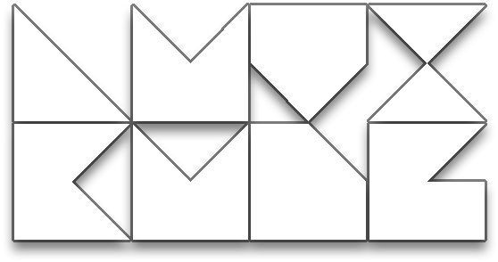

# LuviKunG's GitHub Portfolio Website

[Link](https://luvikung.github.io) to the live website.

A personal portfolio website built with [Next.js](https://nextjs.org) and [React](https://react.dev), showcasing interactive tools and projects.

## Features

- [**Monokai Color Palette**](https://luvikung.github.io/monokai) - Browse and copy color codes from Monokai color schemes (Default, Bright, Neo)
- [**Texture Manipulator**](https://luvikung.github.io/texturemanipulator) - Upload, resize, split, and combine texture channels
